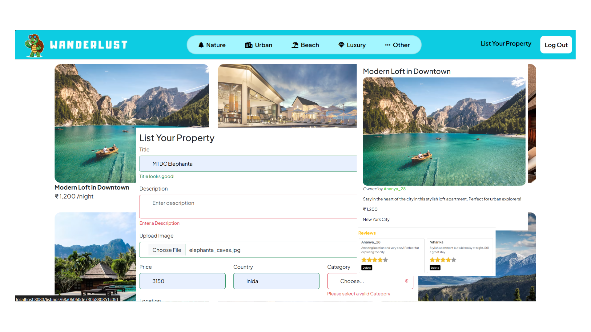

# 🌍 Wandarlust

**Wandarlust** is a full-stack travel listing web application where users can perform CRUD operations on destinations, leave reviews, and enjoy robust server-side and client-side error handling. It uses cookies for session management, supports user authentication, and includes modular utilities for better maintainability. Images are hosted on **Cloudinary** for optimized storage and delivery.

---
## 🚀 Live Demo
Check out the live version of the project here: [Wanderlust Live](https://wanderlust-k1mg.onrender.com)



## 🚀 Features

* ✍️ **Add, Edit, Delete Travel Listings**
* ⭐ **Post & Manage User Reviews**
* 🔒 **User Authentication & Session Management**
* ⚠️ **Server-side & Client-side Error Handling**
* 🍪 **Cookie Management & Middleware**
* ☁️ **Cloudinary Image Upload & Storage**
* 🧩 **Mongoose Models:**

  * `Listing`
  * `Review`
  * `User`

---

## 📦 Folder Structure

```
wandarlust/
├── controllers/   # Route logic & handlers
├── init/          # Dummy data initializer
│   └── index.js
├── models/        # Mongoose schemas
├── node_modules/  # Installed dependencies
├── public/        # Static files (CSS, JS, images)
├── routes/        # Express route definitions
├── utils/         # Utility functions/helpers
├── views/         # EJS templates
├── .env           # Environment variables (MongoDB URI, Cloudinary keys)
├── app.js         # Main server file
├── cloudConfig.js # Cloudinary configuration
├── middleware.js  # Express middleware
├── schema.js      # Any schema helpers
├── test.js        # Test scripts (if any)
├── package.json
├── package-lock.json
└── README.md
```

---

## 🛠️ Setup Instructions

1. **Clone the Repository:**

```bash
git clone https://github.com/Ananya-Yadav-Dev/WanderLust.git
```

2. **Install Dependencies:**

```bash
npm install
```

3. **Setup Environment Variables**

Create a `.env` file in the root with:

```
MONGO_URI=your_mongodb_connection_string
CLOUDINARY_CLOUD_NAME=your_cloud_name
CLOUDINARY_API_KEY=your_api_key
CLOUDINARY_API_SECRET=your_api_secret
```

4. **Initialize Dummy Data:**

```bash
node init/index.js
```

5. **Start the Server:**

```bash
nodemon app.js
```

---

## 🧪 Tech Stack

* **Backend:** Node.js, Express
* **Frontend:** EJS, HTML/CSS
* **Database:** MongoDB with Mongoose
* **Extras:** Cookie-based sessions, Middleware, Modular Utilities, Cloudinary Image Upload

---

## 🤝 Contributions & Issues

Feel contribute, or raise issues to help improve **Wandarlust**.
Every contribution makes a difference!

